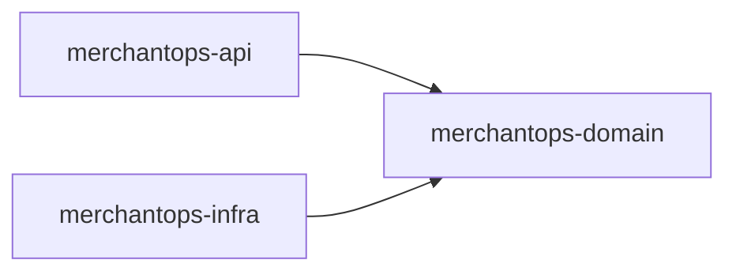

# Java Architecture Map

Last updated: 2026-03-26

## Purpose

This page is the short placement guide for the current Java codebase.

Use it when deciding where a new type should live, when moving code across modules, or when reviewing whether a refactor respects the intended boundaries.

## Module Dependency Map

- `merchantops-api` owns Spring Boot bootstrap, HTTP contracts, request-context handling, application orchestration, and public API surfaces.
- `merchantops-domain` owns business use cases, ports, records, and shared business errors.
- `merchantops-infra` owns JPA entities, Spring Data repositories, and adapters that implement domain ports.

## Placement Guide

| Type of code | Package home | Notes |
| --- | --- | --- |
| Controller or Swagger contract | `api.<capability>` | Keep public endpoint ownership inside the capability package. |
| HTTP request or response DTO | `api.dto.<capability>` | DTOs stay API-only. |
| Application service, mapper, coordinator, worker adapter | `api.<capability>` | Own orchestration here, not in `domain` or `infra`. |
| Ticket AI endpoint orchestration | `api.ticket.ai` | Keep ticket-facing AI flow with the ticket capability. |
| Shared AI client, provider wire model, provider failures | `api.ai.client`, `api.ai.core`, `api.ai.ticket` | Keep vendor/runtime code separate from ticket endpoint orchestration. |
| Use case, port, business record, policy | `domain.<capability>` | Domain stays framework-light. |
| Shared business error | `domain.shared.error` | Keep `BizException` and `ErrorCode` here. |
| JPA adapter implementing a domain port | `infra.<capability>` | Adapter owns mapping between domain contracts and persistence. |
| Entity or repository | `infra.persistence.entity`, `infra.repository` | Never import these directly into `merchantops-api`. |

## API Package Map

- Capability packages:
  - `api.auth`
  - `api.user`
  - `api.rbac`
  - `api.ticket`
  - `api.ticket.ai`
  - `api.importjob`
  - `api.importjob.messaging`
  - `api.importjob.replay`
  - `api.approval`
  - `api.audit`
- Shared AI runtime packages:
  - `api.ai.client`
  - `api.ai.core`
  - `api.ai.ticket`
- Cross-cutting platform packages:
  - `api.platform`
  - `api.config`
  - `api.context`
  - `api.exception`
  - `api.filter`
  - `api.security`
  - `api.doc`
  - `api.tools`

Root `api.controller`, `api.contract`, `api.service`, and `api.messaging` are no longer the default placement for business code. Keep them limited to legacy leftovers or non-business platform endpoints until those classes are absorbed by a capability package.

## Capability Examples

- Ticket workflow:
  - controllers and orchestration live in `api.ticket`
  - state/query contracts live in `domain.ticket`
  - persistence adapters live in `infra.ticket`
- Import jobs:
  - API orchestration lives in `api.importjob`
  - worker-specific coordination lives in `api.importjob.messaging`
  - replay file generation lives in `api.importjob.replay`
  - domain contracts live in `domain.importjob`
  - persistence adapters live in `infra.importjob`
- Ticket AI:
  - endpoint orchestration lives in `api.ticket.ai`
  - provider/runtime code lives in `api.ai.*`
  - interaction-record contract lives in `domain.ai`
  - interaction-record persistence lives in `infra.ai`

## Guardrails

- `ApiResponse` stays in `api.platform.response`.
- `BizException` and `ErrorCode` stay in `domain.shared.error`.
- DTOs and Swagger contracts stay in `merchantops-api`.
- Entities and repositories stay in `merchantops-infra`.
- Use `merchantops-api/src/test/java/com/renda/merchantops/api/ArchitectureBoundaryTest.java` plus `.\mvnw.cmd verify` as the enforcement baseline.
