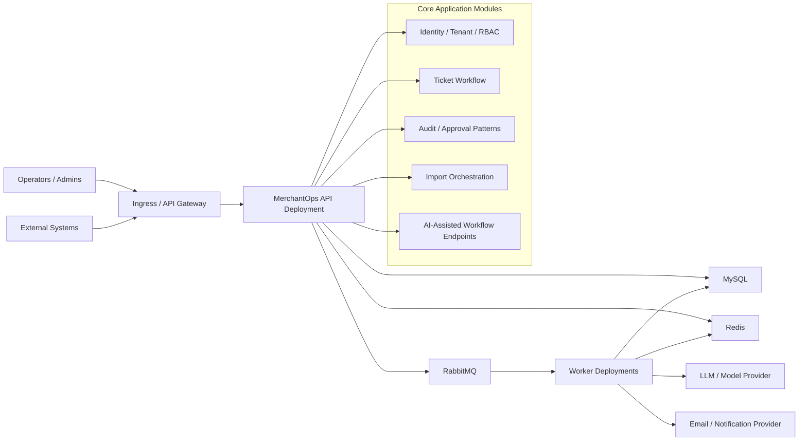
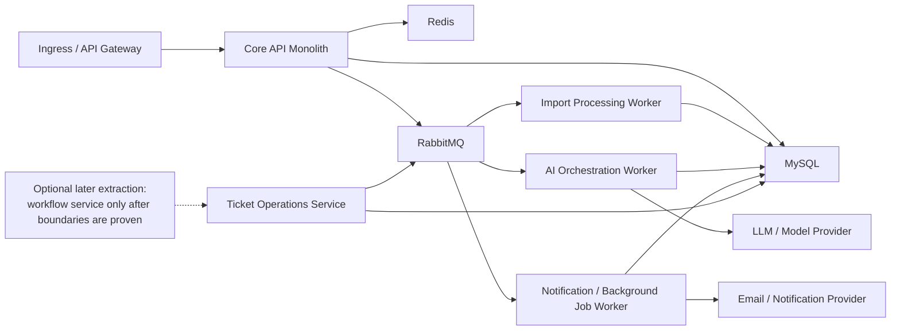

# Target Architecture

Last updated: 2026-03-28

This page visualizes the architecture direction established by [ADR-0010](../architecture/adr/0010-prefer-modular-monolith-and-workload-based-extraction-before-microservices.md).

It is a target-state diagram, not a literal inventory of the current deployment topology or Java module placement. For current module boundaries, read [../architecture/java-architecture-map.md](../architecture/java-architecture-map.md). For the current public baseline and active phase, read [../project-status.md](../project-status.md).

The primary target is a workflow-first modular monolith with explicit tenant, RBAC, and request-context boundaries, deployed as a small number of runtime units. Later extraction is selective and driven by workload shape, not by entity names.

## Primary Runtime Shape

## Selective Extraction Path

## Reading Notes

- `Identity / Tenant / RBAC` stays inside the core boundary early because it is cross-cutting and hard to separate cleanly.
- `Ticket Workflow` is the first real business workflow and should prove the system-of-action shape before broader decomposition.
- `Import Processing`, `AI orchestration`, and `background jobs` are the preferred first extraction candidates because they have clearer runtime and scaling differences.
- Kubernetes supports this architecture cleanly without forcing early microservice fragmentation.
